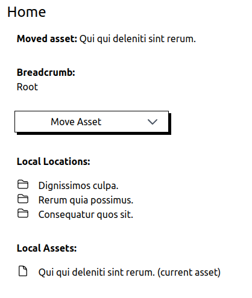

# Forklift Example

> Example for package: [kanata-php/forklift](https://github.com/kanata-php/forklift)

<p style="text-align: center;">

</p>

## Usage

This example uses SQLite, for that, you'll need the extension installed on your OS.

**Step 1**

Clone project:

```shell
git clone https://github.com/kanata-php/forklift-example.git forklift-example
```

**Step 2**

Change to the new directory and install dependencies:

```shell
cd forklift-example
```

```shell
composer install
```

**Step 3**

Run sample migration and seeders:

```shell
php artisan migrate:fresh --seed
```

**Step 4**

Serve app and use it in the browser:

```shell
php artisan serve
```

